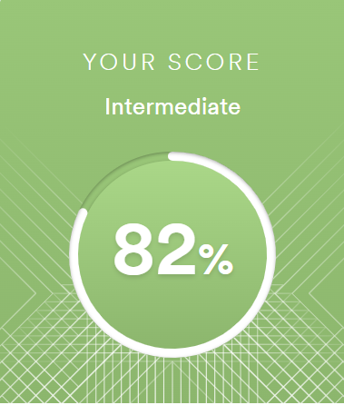

# Raman Kirdzei  
## Engineer of roaming and fraud monitoring  
## Contact information:  
**Phone**: +381600007292 \
**E-mail**: kirdey.roman1@gmail.com \
**Discord**: Raman Kirdzei#6827 \
[LinkedIn](www.linkedin.com/in/raman-kirdzei)
## About myself:  
I have graduated Belarusian State University at the faculty of Radiophysics and Computer technologies. Now I work in the Telekom and Mobile operator at the position of engineer of roaming and fraud monitoring. In march 2022 I was relocated to Serbia. So now I live in Novi Sad but work for Belarus company. I really interested in Front-end development and hope it will be great experience for me.
## Skills:  
* HTML5 basics
* CSS basics
* Git, GitHub

## Code example:
This is just an initial code from Codewars:
function multiply(a, b){
return  a * b
}

## Courses:  
* RS Schools Course «JavaScript/Front-end. Stage 0» (in progress)
## Languages:  
* Russian- Native
* Belarussian - advanced
 English - intermediate (B1, according to the online test at [EFSET](www.efset.org))
